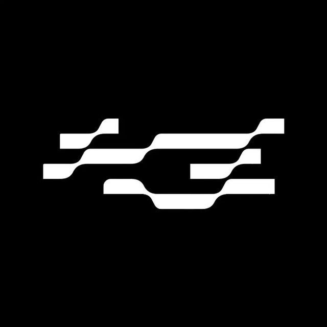

<table>
<tr>
<td valign="middle">

</td>
<td valign="middle">

# The Ace Base

### Where Better Begins.

</td>
</tr>
</table>

**Building what comes next.**

---

## The Ace Base

The Ace Base is an independent technology house focused on building software, digital experiences, and ideas worth exploring.

We care about thoughtful engineering, distinctive design, and the details that make technology feel better to use.

---

## What We Do

- **Software** — Building useful, focused digital products.
- **Web** — Creating fast, responsive, accessible experiences.
- **Design** — Crafting interfaces with clarity and character.
- **Artificial Intelligence** — Exploring practical applications of emerging technology.
- **Experiments** — Turning interesting ideas into things that can actually be used.

---

## Our Philosophy

> **Where Better Begins.**

We believe better technology starts with better thinking.

**01 — Intentional**  
Every decision should have a reason.

**02 — Simple**  
Complexity should earn its place.

**03 — Refined**  
Small details create meaningful differences.

**04 — Useful**  
Technology should solve problems, not create them.

**05 — Curious**  
There is always something worth exploring.

---

## How We Build

We take ideas seriously, but not ourselves.

We explore, prototype, refine, ship, and iterate.

Some ideas become products.  
Some become experiments.  
Some become lessons.

All of them contribute to building something better.

---

## Technology

We choose technology based on the problem rather than following whatever framework is currently having its fifteen minutes of fame.

Our work spans:

`HTML` · `CSS` · `JavaScript` · `Markdown`

Alongside open-source software, AI, modern web infrastructure, and other technologies where they make sense.

---

## Principles

### Build with purpose.
Not everything needs to exist.

### Design with restraint.
Good design does not need to shout.

### Engineer for the long term.
Readable and maintainable software matters.

### Keep improving.
The first version is rarely the best version.

---

## Connect

**GitHub:**  [CEO](https://github.com/aceyash-dev) 
[CCO](https://github.com/acetheticsx) 

**Instagram:** 
[Official Handle](https://instagram.com/tab.gl) 
[CEO](https://instagram.com/archives.of.yash) 

---

© **The Ace Base**  2025 
*Where Better Begins.*